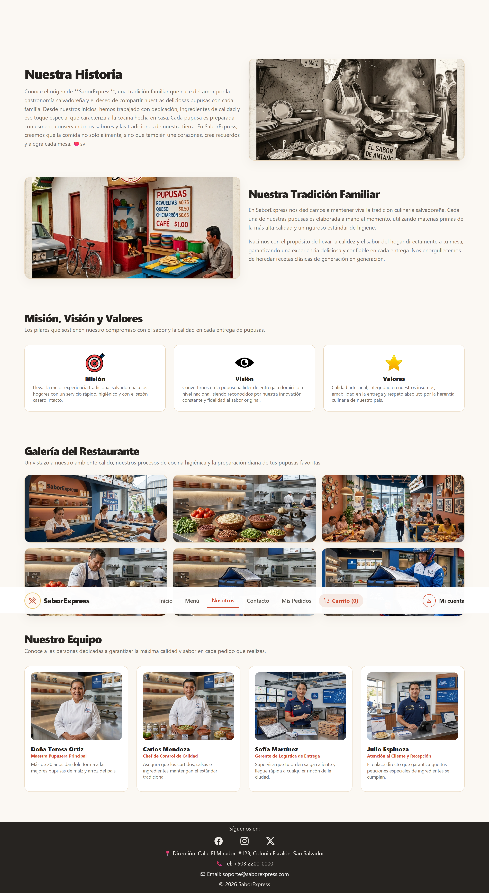
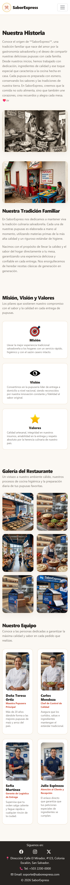

# SaborExpress - Inicio y Nosotros

**Fase 2 · Responsable: Abner · Rama: `Abner`**

Documentación de la página de inicio (landing pública) y la página institucional "Nosotros". Incluye sus funciones, instrucciones de uso, capturas y una guía de pruebas.

La estructura está escrita en HTML5 y CSS3, con Bootstrap para el diseño responsive. Ambas páginas son informativas: no manejan lógica de negocio propia, pero sí mantienen sincronizado el estado del navbar (carrito y sesión) que gestionan otros módulos del proyecto.

[Funciones](#inicio) · [Cómo probarlo](#cómo-probarlo) · [Archivos](#archivos-de-estas-partes) · [Capturas](#capturas) · [Pruebas manuales](#pruebas-manuales)

## Inicio

- Sección principal (hero) con imagen del negocio y llamado a la acción hacia el menú.
- Vista previa de 4 especialidades del menú, con imagen, nombre y descripción.
- Vista previa de la sección "Nosotros" con enlace hacia la página completa.

## Nosotros

- Historia del negocio y su tradición familiar, con imágenes ilustrativas.
- Sección de Misión, Visión y Valores.
- Galería de 6 fotografías del ambiente, preparación e insumos del negocio.
- Sección "Nuestro Equipo" con las 4 personas principales del negocio.

## Cómo probarlo

1. Abre el proyecto con Live Server.
2. Entra a `index.html` para ver la página de inicio.
3. Entra a `nosotros.html` para ver la página institucional.
4. Para comprobar que el navbar refleja la sesión activa, inicia sesión desde `login.html` (cliente) o `admin-login.html` (admin) y vuelve a Inicio o Nosotros: el botón "Mi cuenta" debe mostrar el nombre de la persona en vez del texto por defecto.

No se necesita Firebase, una API key ni instalar dependencias. Se requiere internet para cargar Bootstrap y Bootstrap Icons.

## Archivos de estas partes

- `index.html`: vista de inicio.
- `nosotros.html`: vista institucional.
- `js/inicio-nosotros.js`: script autosuficiente (no importa otros archivos). Actualiza el contador del carrito y el estado de la cuenta en el navbar de ambas páginas, con la misma lógica y las mismas claves de localStorage que usa el Menú.
- `css/inicio-nosotros.css`: estilos de estas dos vistas. Replica la paleta de colores (variables `--se-*`), la tipografía, el navbar, los botones y las tarjetas del Menú, y agrega lo específico de estas páginas (imágenes del hero, historia, galería y equipo, y el footer). Ambas páginas cargan también `styles.css`, compartido con el resto del proyecto.
- `img/inicio/`: imágenes propias de la página de inicio.
- `img/nosotros/`: imágenes propias de la página institucional.
- `img/capturas/`: capturas de escritorio y móvil de Inicio y Nosotros.

## Organización del código

`index.html` y `nosotros.html` no cuentan con lógica de negocio propia: son páginas estáticas construidas con HTML5, CSS3 y Bootstrap. El único JavaScript que cargan es `js/inicio-nosotros.js`, un archivo pequeño que lee datos ya guardados por otros módulos del equipo (el carrito y la sesión) para mostrarlos en el navbar. Lo único que escribe es la copia de un carrito temporal antiguo desde `sessionStorage` a `localStorage`, igual que hace el Menú.

El navbar, la paleta de colores y los componentes visuales siguen el mismo diseño del módulo de Menú y Reportes, de modo que las vistas se ven idénticas al navegar entre ellas. Las clases y variables están declaradas en `css/inicio-nosotros.css`, por lo que estas páginas no dependen de `css/menu-reportes.css`.

## Pruebas manuales

Esta tabla es una guía para comprobar las funciones antes de entregar; no representa una ejecución de pruebas en navegador.

| Prueba | Pasos | Resultado esperado |
| --- | --- | --- |
| Navegación | Abrir `index.html` y recorrer todos los enlaces del navbar | Cada enlace lleva a la página correspondiente, sin errores 404. |
| Especialidades | Revisar la sección "Nuestras Especialidades" en Inicio | Se muestran 4 productos con imagen, nombre y descripción. |
| Vista previa Nosotros | Hacer clic en "Conócenos" desde Inicio | Redirige correctamente a `nosotros.html`. |
| Historia | Abrir `nosotros.html` | Se muestran las secciones de historia, tradición familiar, misión/visión/valores, galería y equipo. |
| Carrito sincronizado | Agregar un producto desde `menu.html` y volver a Inicio o Nosotros | El número en la píldora "Carrito" refleja la cantidad agregada. |
| Sesión sincronizada | Iniciar sesión (cliente o admin) y volver a Inicio o Nosotros | El botón "Mi cuenta" muestra el nombre de la persona y el link apunta a la vista correcta según su rol. |
| Responsive | Revisar ambas páginas en escritorio y en un ancho de 375 px | El navbar se contrae en el menú hamburguesa y las secciones se apilan en una sola columna. |

## Capturas

Las siguientes imágenes muestran las páginas de Inicio y Nosotros en escritorio y móvil.

### Inicio en escritorio

Sección principal con llamado a la acción, especialidades destacadas y vista previa de Nosotros.


### Nosotros en escritorio

Historia, tradición familiar, misión, visión y valores, galería del restaurante y equipo.



### Vistas móviles

<details>
<summary>Ver Inicio en móvil</summary>

La navegación se contrae y las secciones se muestran en una columna.


</details>

<details>
<summary>Ver Nosotros en móvil</summary>

Las secciones de historia, valores, galería y equipo se apilan para adaptarse al ancho de la pantalla.



</details>

## Ejecución y publicación

Se recomienda abrir el proyecto desde un servidor HTTP como Live Server y no haciendo doble clic en el HTML, porque el resto del sitio (Menú, Reportes y Login) usa módulos JavaScript y el navbar de estas páginas depende de los datos que ellos guardan. Las páginas funcionan como archivos estáticos y no necesitan un proceso de compilación.

Al integrar estos módulos en el despliegue del equipo, deben incluirse `index.html`, `nosotros.html`, `css/inicio-nosotros.css`, `js/inicio-nosotros.js` y las imágenes de `img/inicio/`, `img/nosotros/` e `img/capturas/`. Las rutas son relativas para permitir su uso dentro de un sitio de GitHub Pages.

**Sitio publicado:** enlace pendiente de confirmar con el equipo.

## Limitaciones

- El negocio es ficticio: las imágenes de Inicio y Nosotros fueron generadas con IA manteniendo una misma paleta y estilo visual, no corresponden a un local real.
- Estas páginas no crean ni modifican datos del carrito o la sesión; solo los leen para reflejarlos en el navbar.
- El contador del carrito y el estado de la cuenta dependen de que otros módulos del equipo (Menú, Login) hayan guardado correctamente esos datos en localStorage.

## Integración con el equipo

La rama `Abner` contiene `index.html`, `nosotros.html` y sus archivos CSS/JS asociados. La entrega de estos módulos se revisa comparando sus cambios con `main` en un Pull Request. Las otras páginas no deben eliminarse.

El README principal del equipo puede enlazar esta documentación así:

```markdown
[Inicio y Nosotros - Abner](READ-ME-ABNER.md)
```