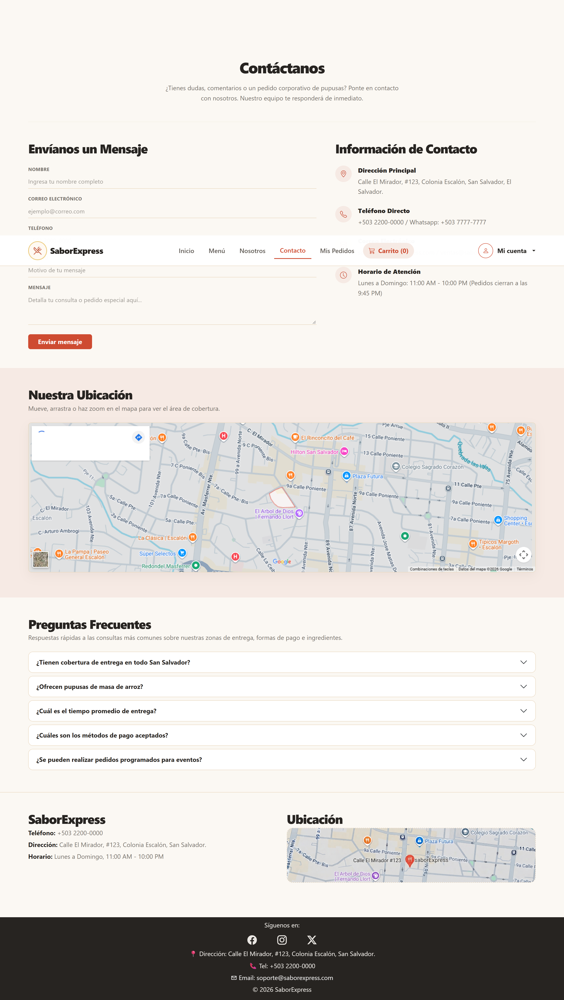
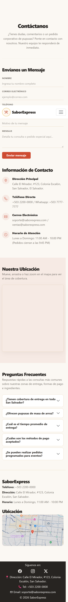

# SaborExpress - Contacto y Administración de Pedidos

**Fase 2 · Responsable: Blanca · Rama: `Blanca`**

Documentación de la página de contacto pública y del panel administrativo de pedidos. Incluye sus funciones, instrucciones de uso, capturas y una guía de pruebas.

La lógica está escrita en JavaScript vanilla, con HTML5, CSS3 y Bootstrap para las vistas. Los datos se guardan en localStorage, sin backend.

[Funciones](#contacto) · [Cómo probarlo](#cómo-probarlo) · [Archivos](#archivos-de-estas-partes) · [Capturas](#capturas) · [Pruebas manuales](#pruebas-manuales)

## Contacto

- Formulario de contacto (nombre, correo, teléfono, asunto, mensaje) con validación de campos obligatorios.
- Sección de información de contacto (dirección, teléfono, correo, horario).
- Mapa interactivo de cobertura de entregas, centrado en la zona del negocio.
- Preguntas frecuentes en formato acordeón.

## Administración de Pedidos

- Tabla con todos los pedidos registrados: ID, cliente, total y estado.
- Filtro por estado (Todos, Pendiente, Preparando, Entregado).
- Búsqueda por cliente o número de pedido.
- Acceso protegido: solo visible con una sesión de administrador activa.

## Cómo probarlo

1. Abre el proyecto con Live Server.
2. Entra a `contacto.html` y envía el formulario para ver la confirmación.
3. Para ver los pedidos, abre `admin-login.html` e ingresa:
   - Correo: `admin@saborexpress.com`
   - Contraseña: `Admin123`
4. Una vez dentro, serás dirigido a Reportes; desde el navbar administrativo entra a "Pedidos" para ver `admin-pedidos.html`.

El acceso administrativo es simulado. La sesión se guarda en localStorage y se elimina al cerrar sesión.

No se necesita Firebase, una API key ni instalar dependencias. Se requiere internet para cargar Bootstrap, Bootstrap Icons y el mapa embebido de Google Maps.

## Datos de prueba

Los pedidos de demostración se generan automáticamente la primera vez que se consultan, mediante el módulo compartido `js/saborexpress-data.js`.

| Clave | Contenido |
| --- | --- |
| `saborExpressPedidos` | Pedidos de demostración que alimentan la tabla de Admin Pedidos |
| `saborExpressSession` | Sesión administrativa, requerida para entrar a Admin Pedidos |

Los datos se guardan solo en el navegador utilizado. Para volver a generar los pedidos de prueba, elimina `saborExpressPedidos` desde las herramientas del navegador y recarga la página.

## Archivos de estas partes

- `contacto.html` y `js/contacto.js`: vista y funciones de la página de contacto.
- `admin-pedidos.html` y `js/admin-pedidos.js`: vista y funciones del panel de pedidos.
- `js/saborexpress-data.js`: módulo compartido que provee los pedidos de demostración y la lectura de sesión (no es propio de este módulo, lo usan también Reportes y Login administrativo).
- `css/contacto-adminpedidos.css`: estilos de estas dos vistas, junto con `styles.css` del proyecto.

## Organización del código

`js/contacto.js` sincroniza el navbar (carrito y menú de la cuenta) igual que el resto de páginas del sitio, y maneja el envío simulado del formulario (sin backend todavía, solo confirma con una alerta). El mapa de cobertura es un iframe embebido de Google Maps, interactivo (se puede mover y hacer zoom), sin necesidad de una API key.

`js/admin-pedidos.js` importa `obtenerPedidos` y `leerSesion` desde `saborexpress-data.js`. Al cargar, verifica que exista una sesión con `role: "admin"`; si no la hay, redirige a `admin-login.html`. La tabla (`#pedidosBody`) se genera completamente desde JavaScript a partir de los pedidos guardados —el HTML no tiene filas escritas a mano, para que no se dupliquen ni queden datos desactualizados.

## Pruebas manuales

Esta tabla es una guía para comprobar las funciones antes de entregar; no representa una ejecución de pruebas en navegador.

| Prueba | Pasos | Resultado esperado |
| --- | --- | --- |
| Formulario de contacto | Completar y enviar el formulario | Muestra confirmación y limpia los campos. |
| Validación de contacto | Enviar el formulario con campos obligatorios vacíos | El navegador impide el envío y marca los campos faltantes. |
| Mapa interactivo | Arrastrar y hacer zoom en el mapa de la sección "Nuestra Ubicación" | El mapa responde al arrastre y al zoom sin recargar la página. |
| Acceso a Pedidos sin sesión | Abrir `admin-pedidos.html` directamente sin haber iniciado sesión | Redirige a `admin-login.html`. |
| Listado de pedidos | Entrar con la cuenta de demostración | La tabla se llena con los pedidos guardados en `saborExpressPedidos`. |
| Filtro por estado | Elegir "Entregado" | Solo se muestran los pedidos con ese estado. |
| Búsqueda | Buscar un ID o nombre de cliente existente y luego uno inexistente | Filtra correctamente y muestra el aviso de "sin resultados" cuando corresponde. |
| Cerrar sesión | Cerrar sesión desde el menú de la cuenta y volver a Pedidos | Solicita iniciar sesión nuevamente. |
| Responsive | Revisar ambas páginas en escritorio y en un ancho de 375 px | El navbar se contrae y la tabla se puede desplazar horizontalmente sin romper el diseño. |

## Capturas

### Contacto en escritorio

Formulario de contacto, información de la pupusería, mapa interactivo de cobertura y preguntas frecuentes.



### Admin Pedidos en escritorio

Panel administrativo con filtro por estado, buscador y tabla de pedidos activos.


### Vistas móviles

<details>
<summary>Ver Contacto en móvil</summary>

El formulario, la información de contacto, el mapa y las preguntas frecuentes se apilan en una sola columna.



</details>

<details>
<summary>Ver Admin Pedidos en móvil</summary>

Los filtros de estado y la tabla de pedidos se ajustan al ancho disponible, con desplazamiento horizontal en la tabla.


</details>

## Ejecución y publicación

Se debe abrir el proyecto desde un servidor HTTP como Live Server, no haciendo doble clic en el HTML, porque se usan módulos JavaScript. Las páginas funcionan como archivos estáticos y no necesitan un proceso de compilación.

Al integrar estos módulos en el despliegue del equipo, deben incluirse `contacto.html`, `admin-pedidos.html`, `js/contacto.js`, `js/admin-pedidos.js`, `js/saborexpress-data.js` y `css/contacto-adminpedidos.css`. Las rutas son relativas para permitir su uso dentro de un sitio de GitHub Pages.

**Sitio publicado:** enlace pendiente de confirmar con el equipo.

## Limitaciones

- La cuenta administrativa es de prueba y sus credenciales son públicas. No debe usarse una contraseña real para esta simulación.
- El formulario de contacto no envía correos reales; solo simula la confirmación en el navegador.
- El negocio es ficticio: el mapa muestra la zona real de Colonia Escalón, San Salvador, pero SaborExpress no aparece marcado ahí porque no existe en Google Maps.
- Los pedidos que se ven en Admin Pedidos son de demostración; todavía no reflejan compras reales hechas desde el Carrito y el Checkout, porque esos módulos están pendientes de conectarse al mismo almacenamiento (`saborExpressPedidos`).
- localStorage se puede modificar desde el navegador; la sesión por rol no sustituye una autenticación de servidor.

## Integración con el equipo

La entrega de estos módulos se revisa comparando sus cambios con `main` en un Pull Request. Las otras páginas no deben eliminarse.

El README principal del equipo puede enlazar esta documentación así:

```markdown
[Contacto y Administración de Pedidos - Blanca](READ-ME-CONTACTO-ADMIN.md)
```