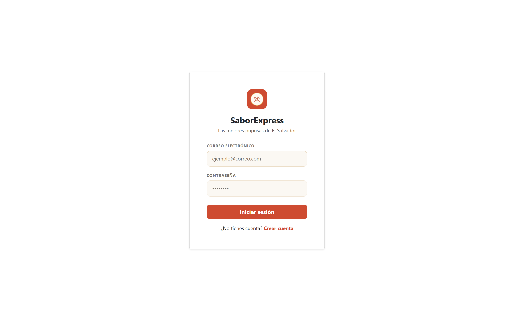
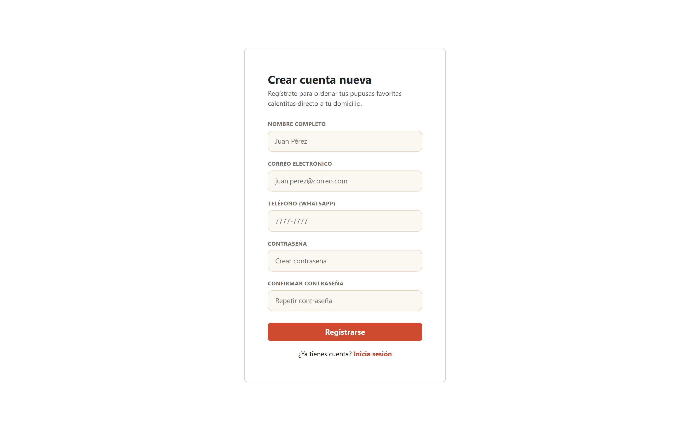
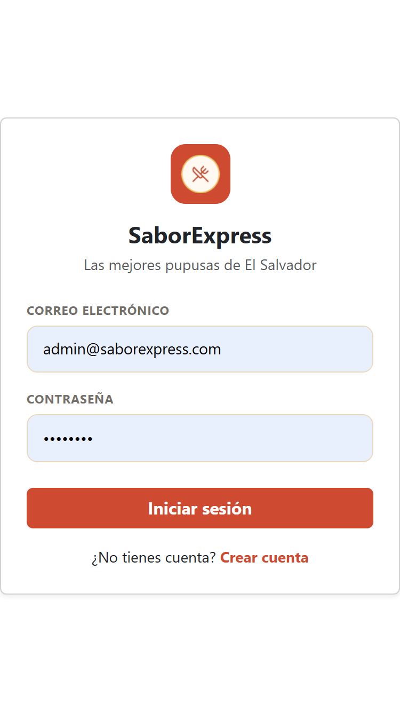
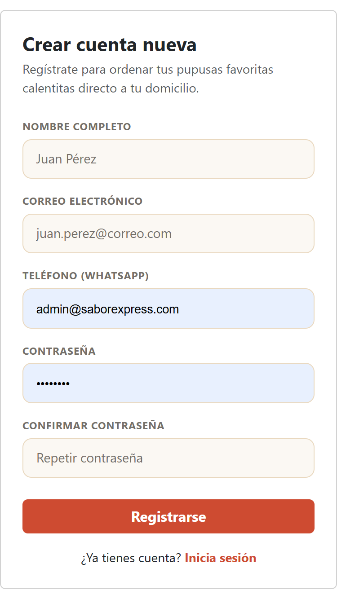

# SaborExpress - Login, Registro y Mis Pedidos

**Fase 2 · Responsable: Elías · Rama: `Elías`**

Documentación del acceso de clientes (inicio de sesión y creación de cuenta) y del seguimiento de sus pedidos. Incluye sus funciones, instrucciones de uso, capturas y una guía de pruebas.

La lógica está escrita en JavaScript vanilla, con HTML5, CSS3 y Bootstrap para las vistas. Los datos se guardan en localStorage, sin backend.

[Funciones](#login) · [Cómo probarlo](#cómo-probarlo) · [Archivos](#archivos-de-estas-partes) · [Capturas](#capturas) · [Pruebas manuales](#pruebas-manuales)

## Login

- Formulario de inicio de sesión para clientes (correo y contraseña).
- Valida contra las cuentas creadas en Registro y guarda la sesión en localStorage.
- Si ya hay una sesión de cliente activa, redirige automáticamente a Mis Pedidos.

## Registro

- Formulario de creación de cuenta (nombre, correo, teléfono, contraseña).
- Valida campos obligatorios, longitud mínima de contraseña y que las contraseñas coincidan.
- Impide registrar dos cuentas con el mismo correo.
- Al registrarse correctamente, inicia sesión de forma automática.

## Mis Pedidos

- Muestra el pedido en curso con una línea de tiempo de su estado (recibido, en preparación, en camino, entregado).
- Historial de pedidos anteriores en una tabla.
- Sincroniza el navbar (contador del carrito y menú de la cuenta) igual que el resto del sitio.

## Cómo probarlo

1. Abre el proyecto con Live Server.
2. Entra a `registro.html` y crea una cuenta nueva.
3. Al registrarte, se inicia sesión automáticamente y se te redirige a `mis-pedidos.html`.
4. Para probar el login por separado, cierra sesión desde el menú de "Mi cuenta" en el navbar y entra a `login.html` con el correo y contraseña que usaste al registrarte.

No se necesita Firebase, una API key ni instalar dependencias. Se requiere internet para cargar Bootstrap y Bootstrap Icons.

## Datos de prueba

| Clave | Contenido |
| --- | --- |
| `saborExpressUsers` | Cuentas de clientes creadas desde Registro |
| `saborExpressSession` | Sesión activa (cliente o admin) |
| `saborExpressCart` | Carrito, leído para sincronizar el navbar |

Los datos se guardan solo en el navegador utilizado y no se comparten entre equipos. Si se borran los datos del sitio, se pierde la información de las cuentas registradas.

## Archivos de estas partes

- `login.html` y `js/login.js`: vista y lógica de inicio de sesión de clientes.
- `registro.html` y `js/registro.js`: vista y lógica de creación de cuenta.
- `mis-pedidos.html` y `js/mis-pedidos.js`: vista de seguimiento de pedidos y sincronización de su navbar.
- `css/login-mispedidos.css`: estilos de estas tres vistas, junto con `styles.css` del proyecto.
- `img/logo.png`: logo usado en la tarjeta de Login.

## Organización del código

`js/login.js` y `js/registro.js` son autosuficientes y comparten el mismo modelo de datos: un arreglo de usuarios en `saborExpressUsers` (nombre, correo, teléfono y contraseña en texto plano, sin cifrado, propio de una simulación sin backend) y una sesión activa en `saborExpressSession` con la misma forma que usa el login administrativo (`name`, `email`, `role`, `loginAt`), de modo que el resto del sitio (navbar, Contacto, Inicio, Nosotros) puede leerla sin distinguir si la sesión es de cliente o de administrador.

El botón "Mi cuenta" del navbar abre un menú desplegable: si hay sesión activa muestra el nombre de la persona, un enlace a Mis Pedidos y la opción de cerrar sesión; si no hay sesión, muestra "Iniciar sesión" y "Crear cuenta". Esta lógica vive en `actualizarUsuario()`, repetida en cada script de página (siguiendo el mismo patrón que ya usaba el proyecto para sincronizar el carrito).

## Pruebas manuales

Esta tabla es una guía para comprobar las funciones antes de entregar; no representa una ejecución de pruebas en navegador.

| Prueba | Pasos | Resultado esperado |
| --- | --- | --- |
| Registro exitoso | Completar el formulario de Registro con datos válidos | Se crea la cuenta, se inicia sesión y se redirige a Mis Pedidos. |
| Registro duplicado | Registrarse dos veces con el mismo correo | Se muestra un aviso y no se crea una segunda cuenta. |
| Validación de registro | Enviar el formulario con campos vacíos o contraseñas que no coinciden | Se muestra el aviso correspondiente y no se crea la cuenta. |
| Login correcto | Iniciar sesión con un correo y contraseña ya registrados | Se guarda la sesión y se redirige a Mis Pedidos. |
| Login incorrecto | Iniciar sesión con credenciales inválidas | Se muestra "Correo o contraseña incorrectos" y no se guarda sesión. |
| Menú de cuenta con sesión | Con sesión activa, tocar "Mi cuenta" en cualquier página | Se despliega el nombre, un enlace a Mis Pedidos y "Cerrar sesión". |
| Cerrar sesión | Tocar "Cerrar sesión" desde el menú de la cuenta | Se borra la sesión y se vuelve a Inicio mostrando "Mi cuenta" sin nombre. |
| Menú de cuenta sin sesión | Sin sesión activa, tocar "Mi cuenta" | Se despliegan las opciones "Iniciar sesión" y "Crear cuenta". |
| Responsive | Revisar las tres páginas en escritorio y en un ancho de 375 px | Los formularios y la tabla de pedidos se adaptan sin desbordarse. |

## Capturas

### Login en escritorio

Tarjeta de inicio de sesión con el logo de SaborExpress, campos de correo y contraseña, y enlace para crear una cuenta nueva.



### Registro en escritorio

Formulario de creación de cuenta con nombre, correo, teléfono y contraseña, validado antes de registrar al cliente.



### Mis Pedidos en escritorio

Pedido en curso con línea de tiempo de su estado y tabla con el historial de pedidos anteriores.


### Vistas móviles

<details>
<summary>Ver Login en móvil</summary>

La tarjeta de inicio de sesión se centra y ocupa el ancho disponible de la pantalla.



</details>

<details>
<summary>Ver Registro en móvil</summary>

El formulario de registro se adapta a una sola columna, manteniendo todos los campos accesibles.



</details>

<details>
<summary>Ver Mis Pedidos en móvil</summary>

La línea de tiempo del pedido y la tabla de historial se apilan para adaptarse al ancho de la pantalla.


</details>

## Ejecución y publicación

Se recomienda abrir el proyecto desde un servidor HTTP como Live Server y no haciendo doble clic en el HTML, porque estas páginas usan módulos JavaScript. Las páginas funcionan como archivos estáticos y no necesitan un proceso de compilación.

Al integrar estos módulos en el despliegue del equipo, deben incluirse `login.html`, `registro.html`, `mis-pedidos.html`, `js/login.js`, `js/registro.js`, `js/mis-pedidos.js`, `css/login-mispedidos.css` e `img/logo.png`. Las rutas son relativas para permitir su uso dentro de un sitio de GitHub Pages.

**Sitio publicado:** enlace pendiente de confirmar con el equipo.

## Limitaciones

- Las contraseñas se guardan en texto plano en localStorage; es una simulación educativa, no debe usarse una contraseña real.
- localStorage se puede modificar desde el navegador; la sesión no sustituye una autenticación de servidor.
- `mis-pedidos.html` todavía muestra datos de ejemplo escritos en el HTML: la conexión con pedidos reales creados desde el Carrito y el Checkout está pendiente de que esos módulos queden terminados.
- Cambiar de navegador, dominio o puerto cambia el almacenamiento disponible (y por tanto las cuentas registradas).

## Integración con el equipo

La entrega de estos módulos se revisa comparando sus cambios con `main` en un Pull Request. Las otras páginas no deben eliminarse.

El README principal del equipo puede enlazar esta documentación así:

```markdown
[Login, Registro y Mis Pedidos - Elías](READ-ME-LOGIN.md)
```