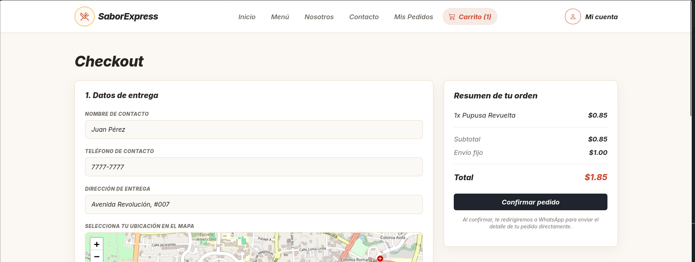
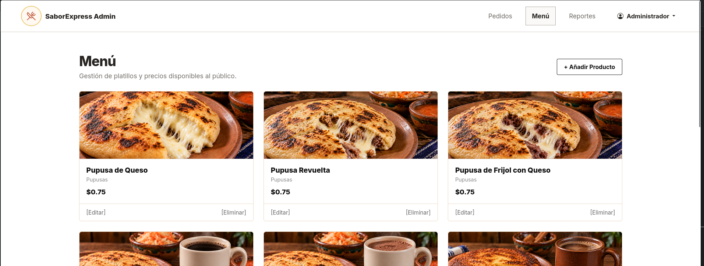
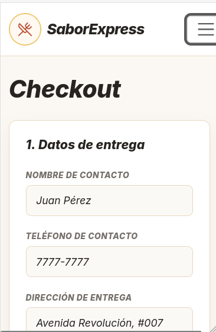

# SaborExpress - Carrito, Checkout y Admin Menú

**Fase 2 · Responsable: Jason · Rama: `main`**

Documentación de los módulos de gestión de compras, checkout con ubicación interactiva y administración del menú de SaborExpress. Incluye sus funciones, instrucciones de uso, capturas y una guía de pruebas.

La estructura está escrita en HTML5, CSS3 y JavaScript vanilla, con Bootstrap para el diseño responsive y Leaflet.js para el mapa interactivo. Los módulos gestionan la persistencia del pedido a través de `localStorage` y el procesamiento final hacia la API de WhatsApp.

[Funciones](#carrito) · [Cómo probarlo](#cómo-probarlo) · [Archivos](#archivos-de-estas-partes) · [Capturas](#capturas) · [Pruebas manuales](#pruebas-manuales)

## Carrito

- Tabla dinámica con persistencia unificada en `localStorage` mediante la clave `saborexpress_cart`.
- Controles de incremento (`+`) y decremento (`-`) de cantidades fluidos y sin bloqueos.
- Eliminación automática del producto de la lista cuando su cantidad llega a cero.
- Cálculo automático de subtotales por ítem, subtotal general y total de la orden.
- Sincronización en tiempo real del contador de productos (badge) en el navbar de todas las páginas.

## Checkout

- Resumen consolidado del pedido con desglose de productos, cantidades, subtotal y envío fijo ($1.00).
- Mapa interactivo con Leaflet.js centrado en San Salvador con pin/marcador arrastrable para fijar la dirección de entrega.
- Selección exclusiva de método de pago entre *Efectivo (Contra entrega)* y *Transferencia bancaria*.
- Envío de confirmación con mensaje formateado hacia WhatsApp, limpiando la sesión del carrito al finalizar.

## Admin Menú

- Panel de administración para agregar y editar el catálogo de productos del menú.
- Mapeo dinámico de imágenes locales desde la carpeta `img/menú/` (respetando nombres de archivos con acentos).
- Persistencia de los platillos creados en `saborexpress_menu` para alimentar el menú público en tiempo real.

## Cómo probarlo

1. Abre el proyecto con Live Server.
2. Entra a `menu.html`, agrega productos y comprueba que el número del carrito en el navbar aumente.
3. Entra a `carrito.html` para probar los botones de sumar (`+`) y restar (`-`), y verifica que los productos se eliminen si la cantidad llega a 0.
4. Haz clic en "Continuar al checkout" para ir a `checkout.html`, mueve el pin en el mapa de Leaflet.js, selecciona un método de pago y presiona "Confirmar pedido".
5. Entra a `admin-menu.html` para crear o editar productos del menú local.

No se requiere Firebase ni un backend adicional. Se requiere conexión a internet para cargar Bootstrap, Bootstrap Icons y las capas del mapa de Leaflet.js (OpenStreetMap).

## Archivos de estas partes

- `carrito.html`: vista de la tabla de productos agregados y resumen de la orden.
- `checkout.html`: vista de confirmación, mapa de ubicación y método de pago.
- `admin-menu.html`: vista administrativa para gestionar el catálogo del menú.
- `js/carrito.js`: script unificado que controla la sincronización de `localStorage`, controles `+`/`-`, contador del navbar, mapa Leaflet.js y envío a WhatsApp.
- `js/admin-menu.js`: script para la administración e inclusión de imágenes locales del menú.
- `css/carrito-adminmenu.css`: estilos de la tabla de compras, contenedor del mapa y formularios de administración.
- `img/menú/`: imágenes locales de los productos del menú.
- `img/capturas/`: capturas de pantalla de los módulos en escritorio y móvil.

## Organización del código

`carrito.html`, `checkout.html` y `admin-menu.html` comparten una arquitectura unificada de persistencia basada en `localStorage`. El script `js/carrito.js` actúa como el motor central: lee y escribe los productos en memoria asegurando que los datos persistan entre navegaciones sin duplicar información.

En `checkout.html`, se inicializa Leaflet.js sobre el contenedor `#map` para permitir al cliente fijar su dirección mediante un marcador arrastrable. Al confirmar el pedido, el script construye el mensaje para WhatsApp con el desglose de la orden y vacía el almacenamiento local.

El navbar, la paleta de colores y los componentes visuales siguen el diseño del resto del proyecto, utilizando las clases compartidas en `css/carrito-adminmenu.css` y `styles.css`.

## Pruebas manuales

Esta tabla es una guía para comprobar las funciones antes de entregar; no representa una ejecución de pruebas en navegador.

| Prueba | Pasos | Resultado esperado |
| --- | --- | --- |
| Persistencia | Agregar un producto en `menu.html` y navegar a `carrito.html` | El producto aparece en la tabla con su precio y cantidad exacta. |
| Cantidades (`+` / `-`) | Probar incrementar y decrementar unidades en `carrito.html` | La cantidad y el subtotal se actualizan en tiempo real sin bloquearse. |
| Eliminación | Disminuir la cantidad de un ítem a 0 | El producto se elimina de la tabla y se recalculan los montos. |
| Mapa interactivo | Mover el marcador pin y hacer clic en el mapa de `checkout.html` | La posición del marcador se actualiza correctamente. |
| Cálculo de envío | Verificar el resumen de orden en `checkout.html` | Refleja la suma del subtotal más el costo fijo de envío ($1.00). |
| Envío a WhatsApp | Llenar los datos de contacto y presionar "Confirmar pedido" | Se abre WhatsApp con el mensaje estructurado y el carrito se vacía. |
| Menú Admin | Crear o editar un platillo en `admin-menu.html` | La imagen carga correctamente desde la carpeta local `img/menú/`. |

## Capturas

Las siguientes imágenes muestran los módulos de Carrito, Checkout y Admin Menú en escritorio y móvil.

### Carrito y Checkout en escritorio

Vista de la tabla de compras con controles de cantidad y vista de checkout con mapa interactivo y resumen del pedido.



### Admin Menú en escritorio

Panel de administración para agregar y modificar el catálogo del menú.



### Vistas móviles

<details>
<summary>Ver Carrito en móvil</summary>

La tabla de productos y el resumen de la orden se adaptan verticalmente.


</details>

<details>
<summary>Ver Checkout en móvil</summary>

El formulario de envío, el mapa de Leaflet y las opciones de pago se apilan en una sola columna.



</details>

## Ejecución y publicación

Se recomienda abrir el proyecto desde un servidor HTTP como Live Server y no haciendo doble clic en el HTML, para asegurar el correcto funcionamiento de las funciones de JavaScript y la carga de capas de mapa en Leaflet.js.

Al integrar estos módulos en el despliegue del equipo, deben incluirse `carrito.html`, `checkout.html`, `admin-menu.html`, `css/carrito-adminmenu.css`, `js/carrito.js`, `js/admin-menu.js` y las imágenes de `img/menú/` e `img/capturas/`. Las rutas son relativas para permitir su uso en GitHub Pages.

**Sitio publicado:** enlace pendiente de confirmar con el equipo.

## Limitaciones

- Las imágenes del menú deben estar almacenadas localmente dentro de la carpeta `img/menú/`.
- La carga de capas del mapa en `checkout.html` requiere conexión activa a internet para conectar con OpenStreetMap y Leaflet.js.
- El envío del pedido a WhatsApp depende de contar con conexión a internet y permitir la apertura de pestañas emergentes en el navegador.

## Integración con el equipo

La rama `main` contiene `carrito.html`, `checkout.html`, `admin-menu.html` y sus archivos CSS/JS asociados. La entrega de estos módulos se revisa manteniendo la coherencia con el trabajo del equipo.

El README principal del equipo puede enlazar esta documentación así:

```markdown
[Carrito, Checkout y Admin Menú - Jason](READ-ME-JASON.md)