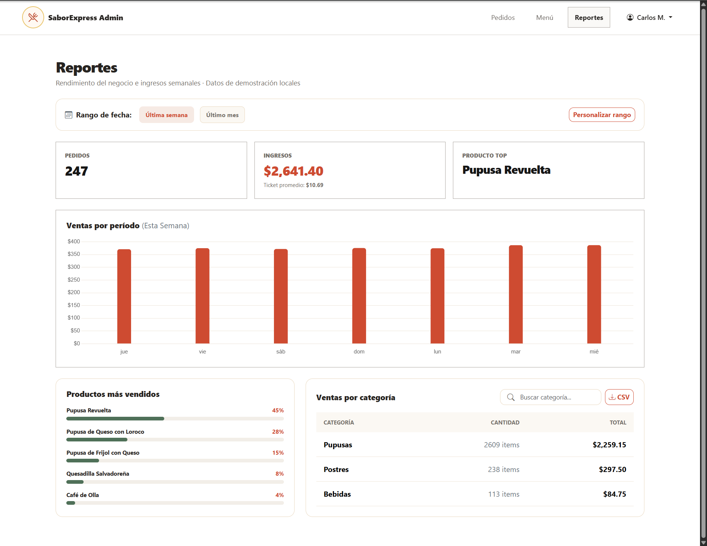
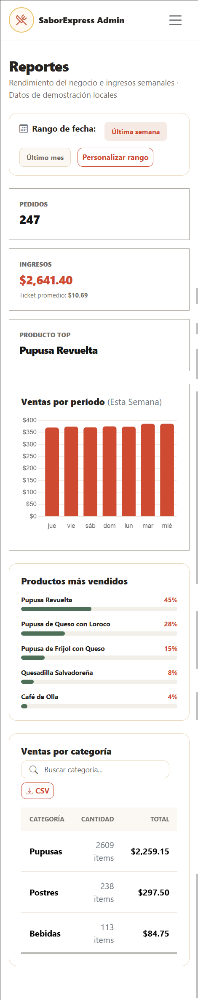

# SaborExpress - Menú y reportes

**Fase 2 · Responsable: Marlene · Rama: `Marlene`**

Documentación del menú de clientes y los reportes administrativos. Incluye sus funciones, instrucciones de uso, capturas y una guía de pruebas.

La lógica está escrita en JavaScript vanilla, con HTML5, CSS3 y Bootstrap para las vistas. Los datos se guardan en localStorage, sin backend.

[Funciones](#menú) · [Cómo probarlo](#cómo-probarlo) · [Archivos](#archivos-de-estas-partes) · [Capturas](#capturas) · [Pruebas manuales](#pruebas-manuales)

## Menú

- Catálogo de 15 productos con imagen y precio.
- Búsqueda por texto y filtros por categoría.
- Paginación y selección de cantidades.
- Agregar productos al carrito y guardarlos en localStorage.

## Reportes administrativos

- Cantidad de pedidos, ingresos, ticket promedio y producto más vendido.
- Gráfica de ventas, productos más vendidos y ventas por categoría.
- Filtros por fecha y búsqueda por categoría.
- Descarga del reporte por categoría en CSV.

## Cómo probarlo

1. Abre el proyecto con Live Server.
2. Entra a `menu.html` para probar el menú.
3. Para ver reportes, abre `admin-login.html` e ingresa:
   - Correo: `admin@saborexpress.com`
   - Contraseña: `Admin123`

El acceso administrativo es simulado. La sesión se guarda en localStorage y se elimina al cerrar sesión.

No se necesita Firebase, una API key ni instalar dependencias. Se requiere internet para cargar Bootstrap, Bootstrap Icons y Chart.js.

## Datos de prueba

El catálogo y los 247 pedidos ficticios se guardan en localStorage la primera vez que se consultan. Los pedidos conservan sus fechas al recargar; para ver fechas anteriores se puede usar el rango personalizado.

| Clave | Contenido |
| --- | --- |
| `saborExpressProductos` | Productos del menú |
| `saborExpressPedidos` | Pedidos de demostración |
| `saborExpressCart` | Productos agregados al carrito |
| `saborExpressSession` | Sesión simulada |

Los datos se guardan solo en el navegador utilizado y no se comparten entre equipos. Si se borran los datos del sitio, se pierde la información guardada. Para volver a generar los pedidos de prueba, elimina `saborExpressPedidos` desde las herramientas del navegador y recarga los reportes.

## Archivos de estas partes

- `menu.html` y `js/menu.js`: vista y funciones del menú.
- `admin-reportes.html` y `js/admin-reportes.js`: vista y funciones de reportes.
- `admin-login.html` y `js/admin-login.js`: acceso simulado para probar reportes.
- `js/saborexpress-data.js`: productos, pedidos de prueba y lectura de sesión.
- `css/menu-reportes.css`: estilos de estas vistas, junto con `styles.css` del proyecto.
- `img/menú/`: imágenes del catálogo. El logo permanece en `img/logo.png`.

## Organización del código

Las páginas HTML cargan sus módulos JavaScript con `type="module"`. El archivo `js/saborexpress-data.js` centraliza la lectura de productos, pedidos y sesión. El menú y los reportes usan esos datos para actualizar la pantalla mediante el DOM.

La lógica de búsqueda, filtros, totales y CSV está escrita en JavaScript vanilla. Bootstrap 5.3.3 aporta el diseño responsive, los modales y las notificaciones; Bootstrap Icons 1.11.3 aporta los iconos y Chart.js 4.4.4 dibuja la gráfica. Los estilos propios están en `css/menu-reportes.css`.

El carrito de este módulo permite agregar y conservar productos. El proceso de compra y la administración de pedidos corresponden a otras partes del proyecto.

## Pruebas manuales

Esta tabla es una guía para comprobar las funciones antes de entregar; no representa una ejecución de pruebas en navegador.

| Prueba | Pasos | Resultado esperado |
| --- | --- | --- |
| Catálogo | Abrir `menu.html` | Mostrar productos con imagen, nombre y precio; hasta 6 por página. |
| Búsqueda | Buscar `Revuelta` y luego una palabra inexistente | Filtrar el producto y mostrar un aviso cuando no haya resultados. |
| Categorías | Vaciar la búsqueda y elegir Bebidas | Mostrar solo bebidas. |
| Cantidades | Usar los botones de aumentar y disminuir | Mantener la cantidad seleccionada entre 1 y 20 por agregado. |
| Carrito | Agregar un producto y recargar | Conservar el contador y los productos en localStorage. |
| Acceso | Abrir reportes sin sesión administrativa | Redirigir al acceso administrativo. |
| Validación de acceso | Enviar campos vacíos, un correo inválido o credenciales incorrectas | Impedir el acceso y mostrar la validación correspondiente. |
| Reportes | Entrar con la cuenta de demostración | Mostrar indicadores y gráfica según los pedidos del rango. |
| Fechas | Aplicar un rango con la fecha inicial posterior a la final | Mostrar un aviso y no aplicar el rango. |
| CSV | Elegir un rango y pulsar CSV | Descargar las ventas por categoría del rango seleccionado. |
| Cerrar sesión | Cerrar sesión y volver a reportes | Solicitar nuevamente el acceso. |
| Responsive | Revisar ambas páginas en escritorio y en un ancho de 375 px | Comprobar que los controles sean accesibles y la navegación se pueda desplegar. |

## Capturas

Las siguientes imágenes muestran el menú y los reportes en escritorio y móvil. Los reportes utilizan pedidos de demostración guardados en el navegador.

### Menú en escritorio

Catálogo con filtros por categoría, buscador, selección de cantidades y paginación.


### Reportes en escritorio

Indicadores de pedidos e ingresos, gráfica por período, productos más vendidos y ventas por categoría.



### Vistas móviles

<details>
<summary>Ver menú en móvil</summary>

La navegación se contrae y los productos se muestran en una columna.


</details>

<details>
<summary>Ver reportes en móvil</summary>

Los indicadores y las secciones de ventas se apilan para adaptarse al ancho de la pantalla.



</details>

## Ejecución y publicación

Se debe abrir el proyecto desde un servidor HTTP como Live Server, no haciendo doble clic en el HTML, porque se usan módulos JavaScript. Las páginas funcionan como archivos estáticos y no necesitan un proceso de compilación.

Al integrar estos módulos en el despliegue del equipo, deben incluirse los HTML, `js/`, los dos archivos CSS y las imágenes del catálogo. Las rutas son relativas para permitir su uso dentro de un sitio de GitHub Pages.

**Sitio publicado:** enlace pendiente de confirmar con el equipo.

## Limitaciones de la demostración

- La cuenta administrativa es de prueba y sus credenciales son públicas. No debe usarse una contraseña real para esta simulación.
- localStorage se puede modificar desde el navegador; la sesión por rol no sustituye una autenticación de servidor.
- Las ventas mostradas proceden de pedidos ficticios, no de compras reales.
- Cambiar de navegador, dominio o puerto cambia el almacenamiento disponible.
- Los pedidos mantienen sus fechas originales; con el paso de los días pueden quedar fuera de “Última semana”. Se pueden consultar con un rango personalizado.

## Integración con el equipo

La rama `Marlene` contiene el proyecto completo como base. La entrega de estos módulos se revisa comparando sus cambios con `main` en un Pull Request. Las otras páginas no deben eliminarse.

El README principal del equipo puede enlazar esta documentación así:

```markdown
[Menú y reportes administrativos - Marlene](READ-ME-MAR.md)
```

La implementación inicial de estos módulos se incorporó en el commit `d5969b2` (`Implementar menu y reportes con almacenamiento local`).
