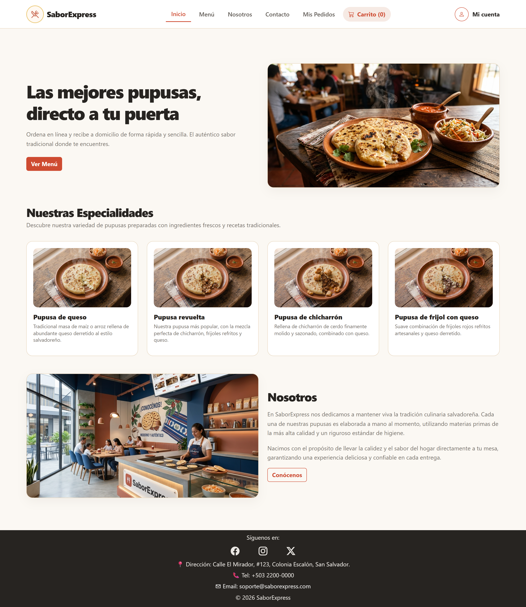
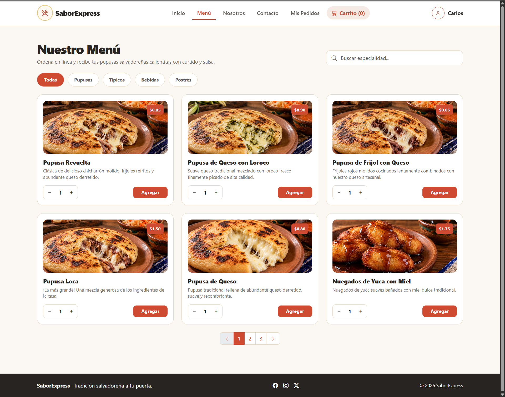
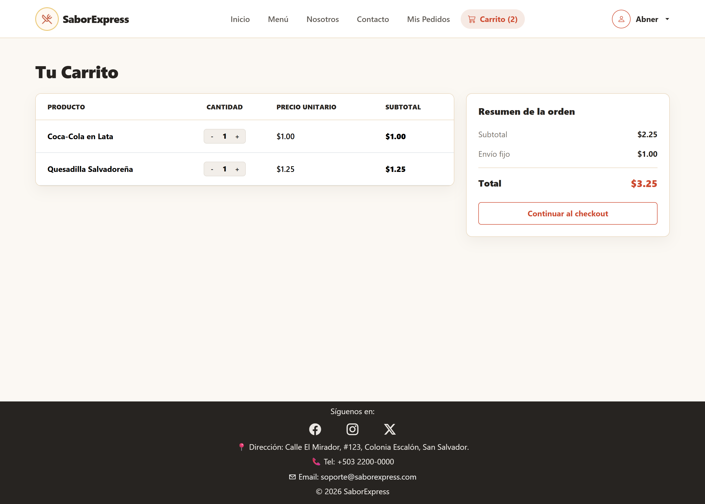
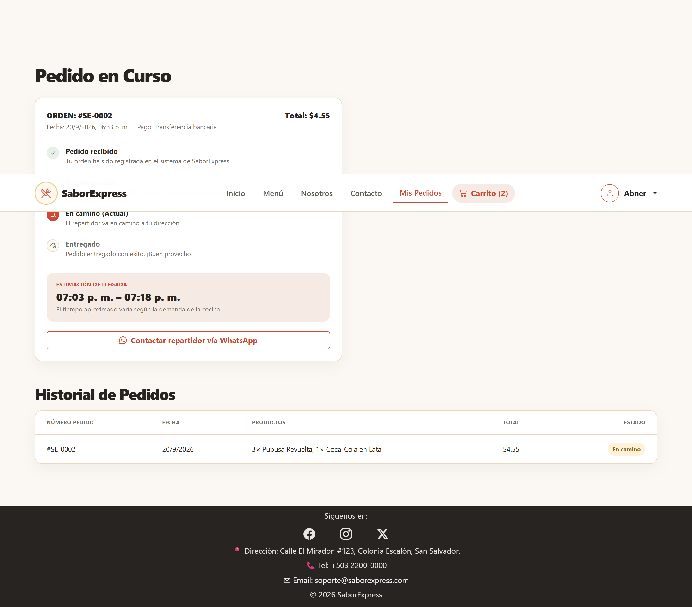
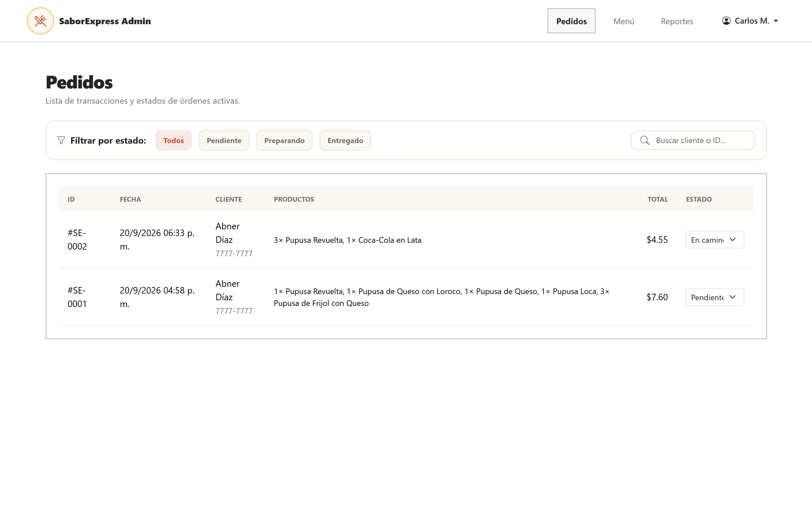
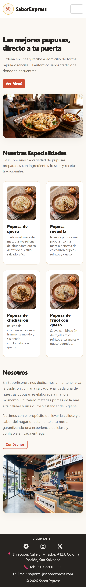
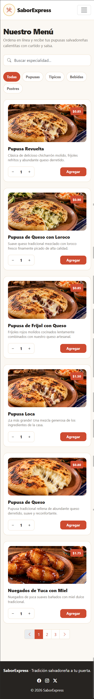
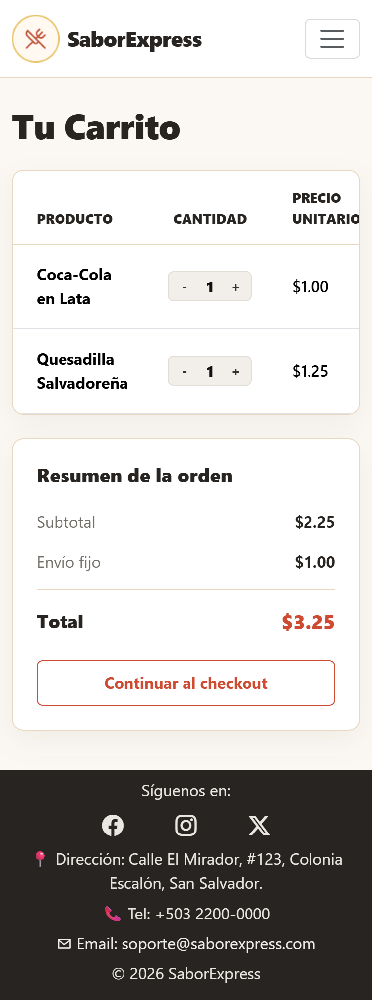
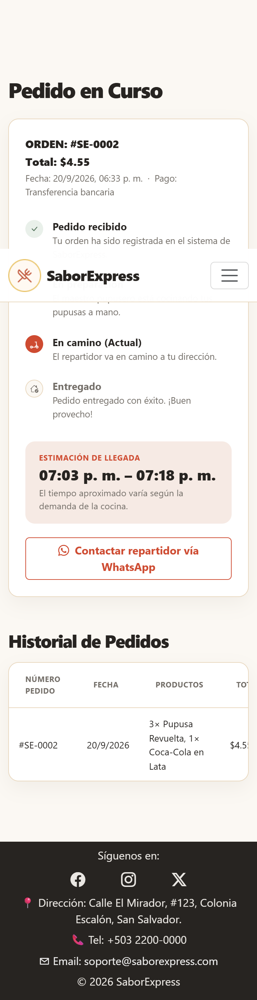
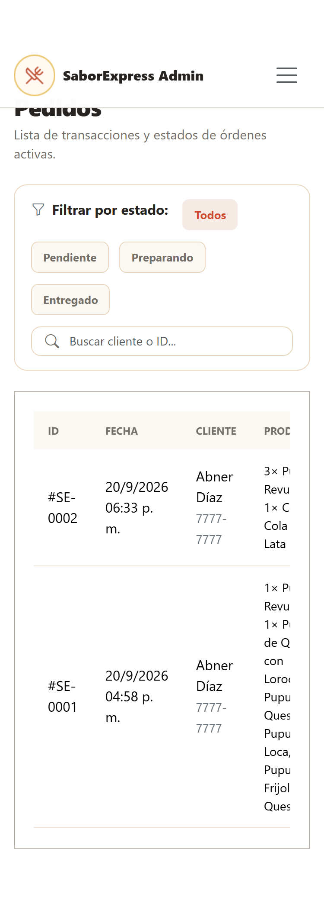

# SaborExpress

SaborExpress es una propuesta de e-commerce gastronómico orientada a la venta de pupusas y alimentos tradicionales salvadoreños. El proyecto fue desarrollado como parte de la etapa de cátedra, con el objetivo de poner en práctica conceptos de maquetación web, interacción con JavaScript, trabajo colaborativo y diseño de experiencia de usuario.

La idea principal del sistema es permitir a un cliente navegar el catálogo, elegir productos, gestionar un carrito de compras y realizar un pedido de forma sencilla, además de ofrecer un panel administrativo para administrar el menú y el estado de los pedidos.

---

## ✨ Descripción general del proyecto

El sitio se compone de varias páginas funcionales que simulan un flujo real de compra en una pupusería:

- Página principal con presentación del negocio y mensajes de promoción.
- Menú interactivo con filtros, búsqueda y paginación.
- Carrito de compras con control de cantidades y resumen de pedido.
- Proceso de registro e inicio de sesión.
- Sección de pedidos del cliente para consultar el estado de sus compras.
- Panel administrativo para gestionar productos y cambiar el estado de los pedidos.
- Área de reportes para una vista general de la operación.

El enfoque del proyecto no fue crear un backend real, sino presentar una solución frontend completa con almacenamiento local mediante `localStorage`, lo cual permite simular persistencia de datos sin necesidad de una base de datos o servidor externo.

---

## 👥 Integrantes del equipo

- Abner Isaí Díaz Rivera — DR261575
- Marlene Yamileth Pérez Alvarado — PA261400
- Elias Grande Beltrán — GB261371
- Jason Steven Durán López — DL261125
- Blanca Margarita Rivas Sandoval — RS260234

El trabajo fue desarrollado en conjunto, distribuyendo tareas según los módulos del proyecto: estructura visual, estilos, lógica de JavaScript, flujo de compra, panel administrativo y documentación final.

---

## 🎯 Objetivo del sistema

El proyecto busca demostrar la capacidad del equipo para:

- diseñar una interfaz moderna y funcional para una tienda en línea;
- organizar la navegación entre páginas y secciones del sitio;
- implementar interacciones con JavaScript sin dependencias pesadas;
- manejar datos del usuario y del catálogo en el navegador;
- aplicar buenas prácticas de UX en un proyecto de tipo e-commerce institucional;
- presentar un entregable profesional de cátedra con una solución completa y coherente.

---

## 🧩 Stack tecnológico

El proyecto se desarrolló principalmente con tecnologías web estándar:

- HTML5 para la estructura de las páginas.
- CSS3 para el diseño visual y la responsividad.
- JavaScript moderno (ES Modules) para la lógica de la aplicación.
- Bootstrap 5 para la base visual y componentes reutilizables.
- Bootstrap Icons para los iconos de la interfaz.
- LocalStorage como mecanismo de persistencia de datos del navegador.

No se empleó un framework complejo ni una arquitectura backend, ya que el objetivo era enfocarse en la lógica del front-end y la experiencia del usuario.

---

## 📁 Estructura del proyecto

```text
Etapa-2-DAW/
├── admin-menu.html
├── admin-pedidos.html
├── admin-reportes.html
├── carrito.html
├── checkout.html
├── contacto.html
├── index.html
├── login.html
├── menu.html
├── mis-pedidos.html
├── nosotros.html
├── registro.html
├── css/
│   ├── carrito-adminmenu.css
│   ├── contacto-adminpedidos.css
│   ├── inicio-nosotros.css
│   ├── login-mispedidos.css
│   └── menu-reportes.css
├── img/
│   ├── capturas/
│   ├── comida/
│   ├── contacto/
│   ├── inicio/
│   ├── menú/
│   └── nosotros/
├── js/
│   ├── admin-menu.js
│   ├── admin-pedidos.js
│   ├── admin-reportes.js
│   ├── carrito.js
│   ├── contacto.js
│   ├── inicio-nosotros.js
│   ├── login.js
│   ├── menu.js
│   ├── mis-pedidos.js
│   ├── registro.js
│   └── saborexpress-data.js
└── README.md
```

---

## 🛠️ Funcionalidades principales

### 1. Catálogo del menú
El módulo principal del cliente permite:

- visualizar productos con nombre, descripción, imagen y precio;
- filtrar por categorías;
- buscar productos por nombre o descripción;
- seleccionar cantidades antes de agregar al carrito;
- paginar el contenido cuando hay varios artículos.

### 2. Carrito de compras
La funcionalidad del carrito incluye:

- adicionar productos con distintas cantidades;
- mantener los datos almacenados en el navegador;
- mostrar el total acumulado;
- permitir edición antes de confirmar la compra.

### 3. Registro e inicio de sesión
La aplicación gestiona usuarios locales con base en `localStorage`, permitiendo:

- crear cuenta nueva;
- iniciar sesión con correo y contraseña;
- redirigir según el tipo de usuario;
- mantener la sesión activa durante la navegación.

### 4. Proceso de checkout
Cuando el cliente confirma su pedido, el sistema genera una orden con información de:

- cliente;
- dirección;
- teléfono;
- método de pago;
- productos seleccionados;
- total final.

### 5. Mis pedidos
Los clientes pueden consultar el historial de sus compras y observar el estado actualizado por el administrador.

### 6. Panel administrativo
El admin cuenta con herramientas para:

- administrar el menú público;
- agregar productos desde un catálogo base;
- editar precios y nombres;
- eliminar productos no deseados;
- filtrar pedidos por estado;
- cambiar el estado de cada pedido (Pendiente, Preparando, En camino, Entregado, Cancelado).

### 7. Reportes
La sección administrativa incluye reportes visuales y datos resumidos para evaluar el funcionamiento del negocio.

---

## 🔐 Credenciales de demostración

Para ingresar al panel administrativo del proyecto, se usa la siguiente cuenta de prueba:

- Correo: `admin@saborexpress.com`
- Contraseña: `Admin123`

> Estas credenciales están diseñadas para pruebas del proyecto y están integradas con la lógica de autenticación local del sistema.

---

## ▶️ Cómo ejecutar el proyecto

Como es un proyecto estático, no requiere instalación compleja.

### Abrir directamente desde el navegador

1. Abre la carpeta del proyecto en tu editor.
2. Localiza el archivo `index.html`.
3. Ábrelo con el navegador o usa la opción de "Open with Live Server" si tienes una extensión instalada.

---

## 📸 Capturas

Las siguientes imágenes muestran las vistas principales del sistema, tanto del lado del cliente como del panel administrativo, en escritorio y en móvil.

### Inicio

Sección principal con la presentación del negocio, llamado a la acción hacia el menú y vista previa de la sección Nosotros.



### Menú

Catálogo de productos con filtros por categoría, buscador, selección de cantidades y paginación.



### Carrito

Resumen de los productos agregados, con control de cantidades, subtotal, envío y total antes de continuar al checkout.



### Mis Pedidos

Seguimiento del pedido en curso con línea de tiempo de su estado, y tabla con el historial de pedidos anteriores del cliente.



### Admin Pedidos

Panel administrativo con filtro por estado, buscador y tabla de todas las órdenes activas del negocio.



<details>
<summary>Ver estas mismas vistas en móvil</summary>

**Inicio en móvil**



**Menú en móvil**



**Carrito en móvil**



**Mis Pedidos en móvil**



**Admin Pedidos en móvil**



</details>

---

## 📌 Consideraciones técnicas

- La lógica de negocio está concentrada en JavaScript del lado del cliente.
- La persistencia se realiza con `localStorage`, lo que simula almacenamiento de datos sin backend.
- La navegación y los formularios están diseñados para funcionar en un ambiente estático.
- El proyecto está orientado a una experiencia de compra simple y clara, pensada para entregar un demo funcional de negocio digital.

---

## ✅ Estado del proyecto

El proyecto se encuentra desarrollado como una propuesta funcional, con navegación completa, catálogo, carrito, autenticación, gestión administrativa y flujo de pedidos en un entorno frontend estático.

Es una solución ideal para demostrar competencias en diseño web, lógica de programación, trabajo en equipo y entrega de un producto con enfoque académico y profesional.